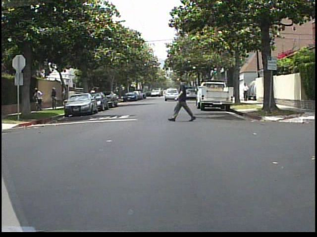

# Caltech Pedestrian Dataset

Dataset was created for the problem of pedestrian detection. 
It contains objects of three classes "person" for single person, 
"people" for group of persons, and "person?" for ambiguous cases. 

Labeling is done in a very strange format usign MATLAB data structures
and saved as ".vbb" files. 

Data is presented as video files of ".seq" format so it's necessary to cut
this videos in separate images.

## Selecting proper images
We would like to exclude images which contain bounding boxes for "people"
and "person?" classes to have data exactly for our problem. So resulting 
dataset should contain images only with "person" instances, and images 
without any of above classes.

## Cutting frames from videos
Cutting could be done using solution from 
[this](https://github.com/jainanshul/caltech-pedestrian-dataset-extractor) 
GitHub repository.

It requires to install some packages:\
`$ sudo apt install nodejs-legacy npm`\
and then to install requirements (run command from repo folder):\
`$ npm install`

Finally run the script for frame cutting (it is assumed that there is folder 
`data/` with unpacked dataset in the same directory):\
`$ node caltech_pd.js`

## Evaluation results
Total number of pictures:  208542\
Total number of pedestrians:  185884\
Total number of pictures with pedestrians:  89482\
Total number of pictures without pedestrians:  119060\
Average of pedestrians per picture with pedestrians:  2.0773\
Average of pedestrians per picture in general:  0.8913
